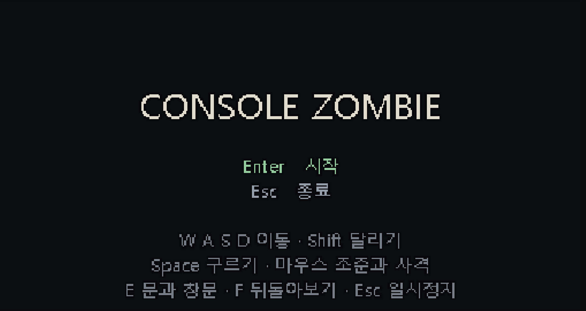
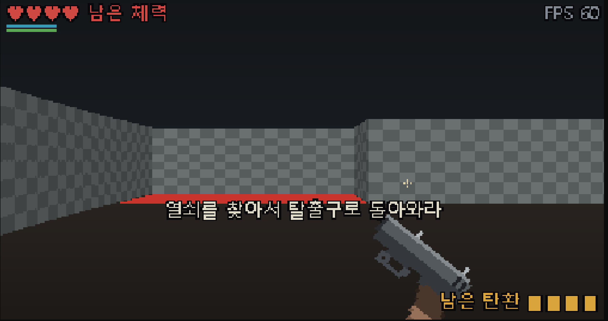

# Console Zombie

Windows Terminal 위에서 동작하는 C++20 기반 2.5D 레이캐스팅 서바이벌 호러
프로토타입입니다. 일반적인 문자 화면 대신 RGB 논리 프레임버퍼를 만들고, ANSI
True Color와 `▀` 반블록 문자로 픽셀 화면을 출력합니다.

플레이어의 목표는 절차적으로 생성된 건물에서 열쇠를 찾은 뒤 출구로 탈출하는
것입니다. 탄약과 스태미나는 제한되어 있고, 이동과 사격으로 만든 소음은 좀비를
깨우거나 문과 창문을 통한 침입을 촉진합니다.

> 현재 단계: **Prototype 0.1** · Windows 전용

## 게임 화면

### 메인 화면



### 첫 시작 화면

열쇠를 찾아 탈출구로 돌아오는 여정의 시작입니다. 터미널 위에 그려지는 1인칭
픽셀 화면과 체력·탄약 HUD를 확인할 수 있습니다.



### 게임 플레이 영상

[](https://youtu.be/yXjKKeqMKQk)

썸네일을 클릭하면 YouTube에서 게임 플레이 영상을 볼 수 있습니다.

## 핵심 특징

- **터미널 픽셀 렌더링** — DDA 레이캐스팅, 깊이 버퍼, 거리 명암, 픽셀 좀비
  스프라이트를 ANSI 24비트 색상으로 출력합니다.
- **절차적 맵 생성** — 쿼드트리로 공간을 나누고 Room Graph와 최소 신장 트리를
  이용해 방과 복도를 연결합니다. 생성된 맵은 플레이 전에 유효성을 검사합니다.
- **경로 탐색과 군중 이동** — A*로 좀비 추적 경로를 계산하고, 근거리 분리 처리로
  여러 좀비가 같은 위치에 겹치지 않도록 합니다. Dijkstra 비용 필드는 벽·문·창문을
  통과하는 소음의 감쇠를 표현합니다.
- **침입 시스템** — 문과 창문은 압력에 따라 `정상 → 경고 → 균열 → 파손`
  상태로 변하며, 깨어난 좀비는 연결된 침입구를 직접 공격합니다.
- **제한된 생존 자원** — 탄약, 체력, 스태미나와 행동별 소음 때문에 전투와
  이동 경로를 선택해야 합니다.
- **데이터 기반 밸런스** — 이동 속도, 좀비 수, 소음, 침입 압력, 렌더링 설정을
  [`Config/GameBalance.ini`](Config/GameBalance.ini)에서 조정할 수 있습니다.
- **결정적 검증** — 고정 시드 맵과 헤드리스 자체 테스트로 생성 규칙, 경로 탐색,
  전투, 화면 흐름, 오디오 파싱을 회귀 검사합니다.

## 실행 환경

- Windows 10 이상
- Windows Terminal

배포된 실행 파일을 사용할 때는 Visual Studio가 필요하지 않습니다. 소스에서 직접
빌드하려면 Visual Studio 2026의 **Desktop development with C++** 워크로드, x64 빌드
환경, Windows SDK 10.0과 C++20 지원이 필요합니다. 별도의 외부 라이브러리는 없으며,
오디오는 Windows에 포함된 XAudio2를 사용합니다.

## Release 다운로드 및 실행

1. 저장소의 [최신 Releases 페이지](../../releases/latest)에서
   `ConsoleZombie-v0.1.0-windows-x64.zip`을 받습니다.
2. ZIP을 완전히 푼 뒤 그 안의 `ConsoleZombie.exe`를 Windows Terminal에서 실행합니다.
3. `ConsoleZombie.exe`, `Config/`, `Assets/`의 상대 위치는 바꾸지 마세요. 설정과
   사운드를 실행 중에 해당 경로에서 읽습니다.

GitHub가 자동으로 표시하는 `Source code (zip)`과 `Source code (tar.gz)`에는 미리
빌드된 실행 파일이 없습니다. 게임을 바로 실행하려면 Release 첨부 파일 중 이름이
`windows-x64.zip`으로 끝나는 파일을 받아야 합니다.

배포 파일에는 아직 코드 서명이 적용되지 않아 Windows가 처음 실행할 때 알 수 없는
게시자 경고를 표시할 수 있습니다. 공식 Release에서 받은 파일인지 확인하고, 함께
올린 `.sha256` 파일과 다음 명령의 결과를 비교할 수 있습니다.

```powershell
Get-FileHash .\ConsoleZombie-v0.1.0-windows-x64.zip -Algorithm SHA256
```

## 소스에서 빌드

저장소 루트에서 Visual Studio x64 Developer PowerShell을 열고 실행합니다.

```powershell
# 최적화된 일반 실행 빌드
msbuild .\ConsoleZombie.sln /t:Build /p:Configuration=Release /p:Platform=x64
.\Bin\x64\Release\ConsoleZombie\ConsoleZombie.exe

# 디버깅용 빌드
msbuild .\ConsoleZombie.sln /t:Build /p:Configuration=Debug /p:Platform=x64
.\Bin\x64\Debug\ConsoleZombie\ConsoleZombie.exe
```

같은 프로젝트를 Visual Studio에서 열어 `Release | x64` 또는 `Debug | x64` 구성으로
실행해도 됩니다. 빌드 과정에서 밸런스 설정과 오디오 자산이 실행 파일 옆으로
복사됩니다.

게임을 실행한 뒤 터미널 창은 사용자가 직접 최대화해야 합니다. 프레임버퍼는 현재
뷰포트 크기에 맞춰 자동으로 조정됩니다. 더 높은 해상도가 필요하면
[`Config/WindowsTerminalProfile.json`](Config/WindowsTerminalProfile.json)을 참고해
Windows Terminal의 글꼴 크기를 줄일 수 있습니다.

### 실행 옵션

| 옵션 | 설명 |
|---|---|
| `--seed <숫자>` | 같은 맵을 재현할 수 있도록 시작 시드를 고정합니다. |
| `--self-test` | 터미널과 오디오 장치를 열지 않고 회귀 테스트를 실행합니다. |
| `--snapshot <경로>` | 지정한 시드의 렌더 결과를 BMP 파일로 저장합니다. |

예시:

```powershell
.\ConsoleZombie.exe --seed 20260826
.\ConsoleZombie.exe --seed 20260826 --snapshot .\PrototypeSnapshot.bmp
```

위 예시는 Release ZIP을 푼 폴더를 기준으로 합니다. 소스 빌드에서는
`ConsoleZombie.exe`를 해당 Debug 또는 Release 출력 경로로 바꾸면 됩니다.

## 게임 조작

| 입력 | 동작 |
|---|---|
| `W` / `S` | 전진 / 후진 |
| `A` / `D` | 시점 회전 |
| `Shift` | 달리기 |
| `Space` | 전방 구르기 |
| `E` | 문 열기 / 깨진 창문 통과 |
| `F` 누르고 있기 | 뒤돌아보기. 보는 동안에는 사격할 수 없습니다. |
| 마우스 이동 | 플레이 중 조준 / 메뉴 버튼 가리키기 |
| 마우스 왼쪽 버튼 | 플레이 중 사격 / 가리킨 메뉴 버튼 클릭 |
| `Enter` | 메인 메뉴에서 시작 / 일시정지 화면에서 계속하기 |
| `Esc` | 일시 정지 / 이전 화면 / 종료 |
| `R` | 같은 시드로 재시작 또는 개발자 모드에서 다음 시드 생성 |
| `N` | 결과 화면에서 새 시드로 시작 |

메인 메뉴, 일시정지 화면, 사망·탈출 결과 화면의 선택지는 키보드 단축키 대신
마우스로 버튼을 가리킨 뒤 클릭해도 동일하게 동작합니다. 여기에는 시작, 종료,
계속하기, 메인 메뉴로 돌아가기, 같은 맵 다시 시작과 새 맵 시작이 모두 포함됩니다.

## 디버그 조작

| 입력 | 동작 |
|---|---|
| `F1` | 쿼드트리 리프가 표시된 디버그 맵 |
| `F2` | 개발자 모드 전환: 무적과 실시간 탑다운 화면 활성화 |
| `F3` | 개발자 모드에서 3D / 전체 탑다운 화면 전환 |
| `F4` | 이동 비용 / 음향 비용 오버레이 전환 |
| `F5` | `GameBalance.ini` 다시 읽기 |
| `[` / `]` | 맵 생성 단계 이전 / 다음 |

과거 맵 생성 단계를 확인하는 동안에는 게임 업데이트가 정지합니다. `LIVE` 단계의
청록색 점은 현재 위치에서 열쇠까지의 A* 경로이며, 열쇠를 얻은 뒤에는 출구까지의
경로로 바뀝니다.

## 밸런스 설정

플레이 수치의 기준은 [`Config/GameBalance.ini`](Config/GameBalance.ini)입니다.
게임은 시작할 때 이 파일을 읽고, `F5` 입력으로 다시 불러옵니다. 숫자가 아니거나
성립하지 않는 설정 조합은 플레이에 들어가기 전에 오류와 함께 거부됩니다.

## 검증

Debug x64 빌드 후 다음 명령으로 자체 테스트를 실행할 수 있습니다.

```powershell
.\Bin\x64\Debug\ConsoleZombie\ConsoleZombie.exe --self-test
```

자체 테스트는 여러 고정 시드에서 맵 생성의 결정성, 방 연결, 열쇠와 출구 경로,
좀비 배치와 추적·개체 간 분리, 소음 감쇠, 문·창문 침입, 사격 판정, 밸런스 파일 검증,
화면 흐름과 WAV 파싱을 확인합니다. 실패하면 해당 검사의 원인을 표준 오류로
출력하고 0이 아닌 종료 코드로 끝납니다.

## 프로젝트 구조

```text
ConsoleZombie/
  AI/          A*와 Dijkstra 공통 탐색
  Game/        게임 루프, 플레이어, 좀비, HUD, 밸런스, 자체 테스트
  Platform/    Windows Terminal, 입력, XAudio2, WAV, 글자 래스터화
  Render/      픽셀 버퍼, 레이캐스팅, 렌더 회귀 해시
  World/       그리드, 절차적 맵 생성과 검증
Assets/Sound/  게임 오디오 자산
Config/        밸런스와 Windows Terminal 프로필
CraftEngine/   초기 콘솔 엔진 실험 코드
```

실행 가능한 현재 프로젝트는 [`ConsoleZombie.sln`](ConsoleZombie.sln)이며,
`CraftEngine`은 초기 구조를 비교하기 위한 참고 코드로 보존되어 있습니다.

## 라이선스

소스 코드와 직접 작성한 문서는 [MIT License](LICENSE)로 배포됩니다. Gemini로 생성한
오디오 7개는 저장소 저작권자가 보유할 수 있는 권리의 범위에서 같은 라이선스로
제공됩니다.

Pixabay에서 가져온 오디오 파일은 MIT 적용 대상이 아니며 Pixabay Content License를
따릅니다. 적용 범위와 재사용 조건은 [Third-Party Notices](THIRD_PARTY_NOTICES.md), 각
파일의 상세 출처와 가공 기록은
[`docs/audio-credits.md`](docs/audio-credits.md)를 확인하세요.
